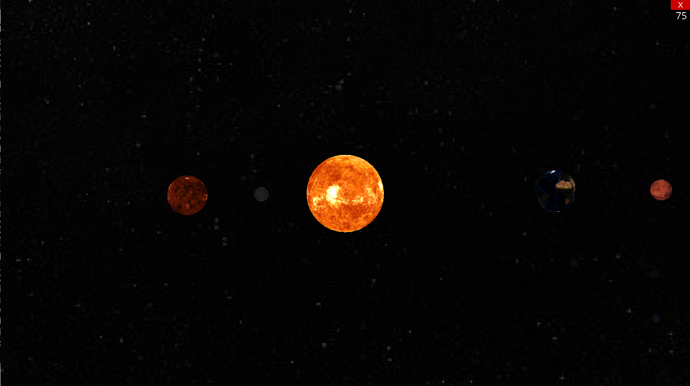

<h1>Planet-Simulation-Ursina</h1>

**Description:** Planetory simulation in 3D that propagates each celestial body's into an orbit based on the gravitaional forces acting on each individual. Inital position's are set arbitrarily and can be modified intividually.

##### Features:
* Relatively accurate representation of planets and their interactive forces.
* 'real time' data on position of planets as per the provided date (In progress..)
* Can add custom celestial bodies and observe the n-body simulation at lower scale.

<h2> Installation & Run</h2>

You can find all the requirements to install a conda venv in `requirements.txt`.	
*